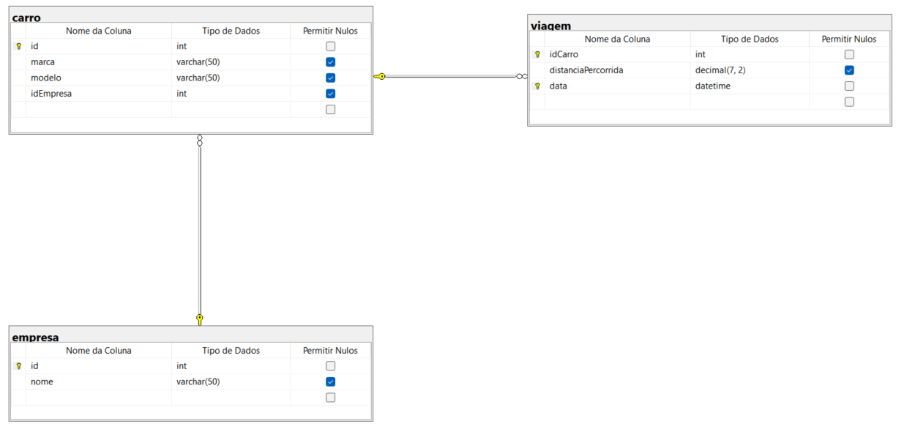

# Simulado para prova de Banco de Dado

Feito em sql server. O exercício foi gerado alatóriamente de acordo com o `registro de aluno`

## Ambiente para as consulta

Em `database.txt`, contém as tabelas do banco de dados e os dados necessários.

Em `questionario.txt`, contém as consultas q dever ser feitas.

## Imagem do Banco de Dados

